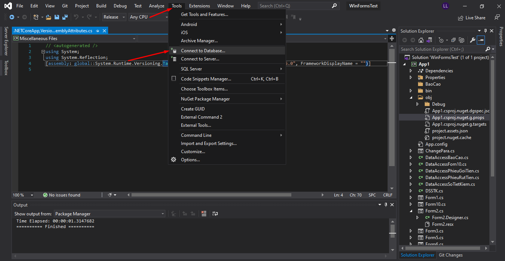
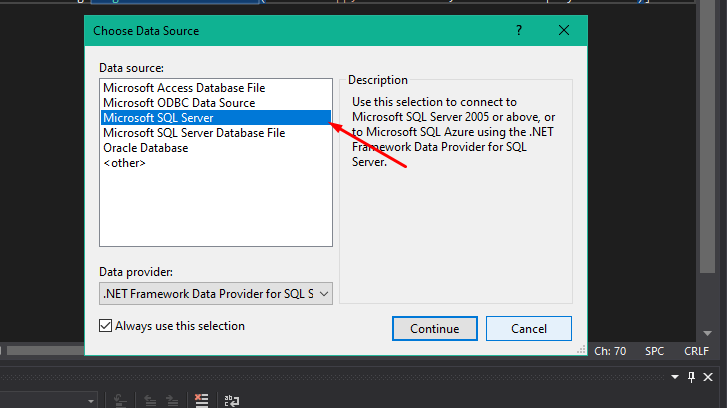
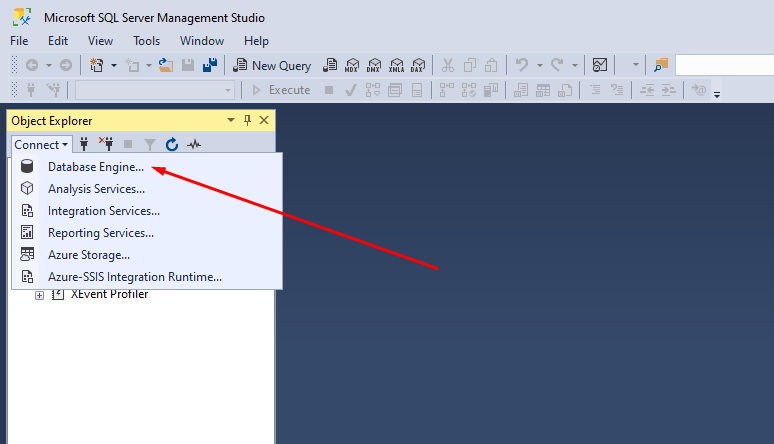
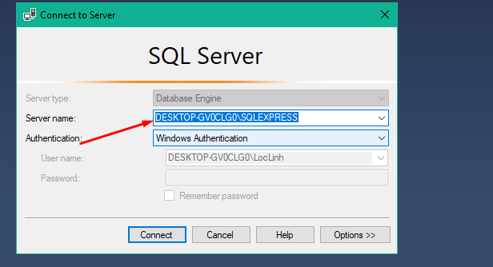
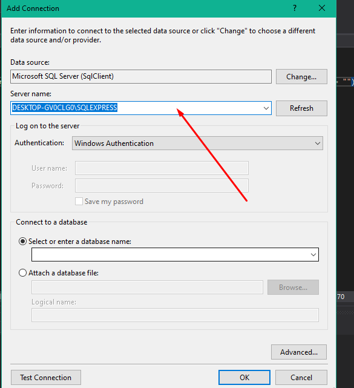
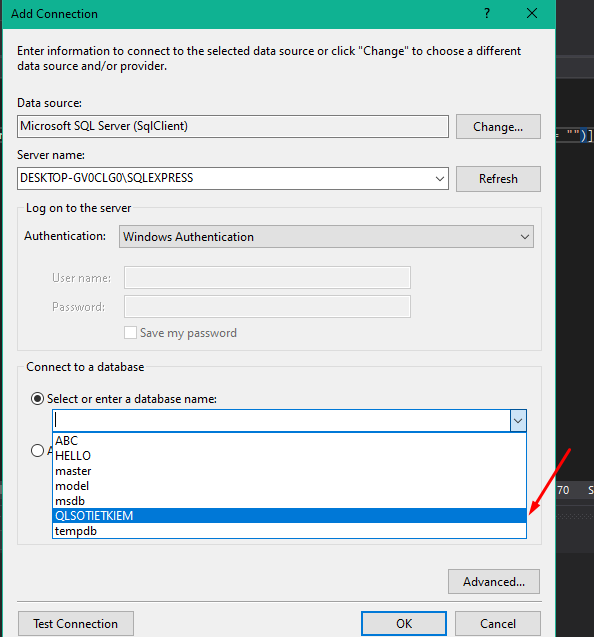
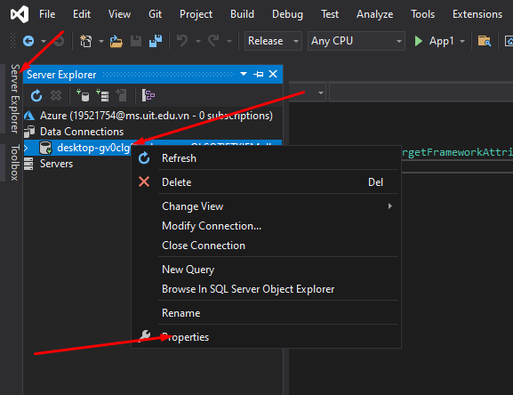
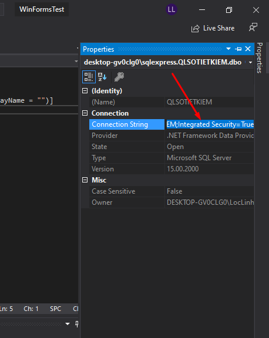
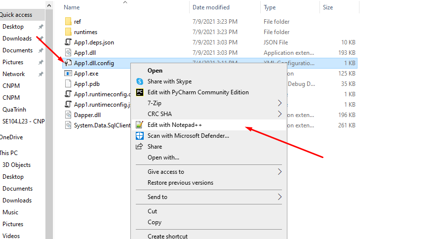
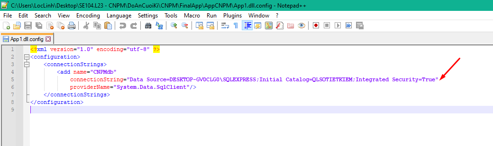

Làm theo các bước sau đây:

B1: Chọn tool -> connect to database

B2: Chọn Microsoft SQL server

B3: Vào sql server chọn connect -> database engine...

B4: Copy server name

B5: Qua bên visual studio dán vào server name

B6: Chọn database muốn kết nối

B7: Bấm server explorer -> chuột phải tên kết nối -> properties

B8: Copy ô bên cạnh connection string

B9: Mở file App1.dll.config bằng notepad hoặc notepad++

B10: Thay đổi phần bên trong ngoặc kép của connection string bằng chuỗi vừa copy

B11: lưu file và sử dụng phần mềm bằng cách mở App1.exe

# nếu không làm đc thì thôi
